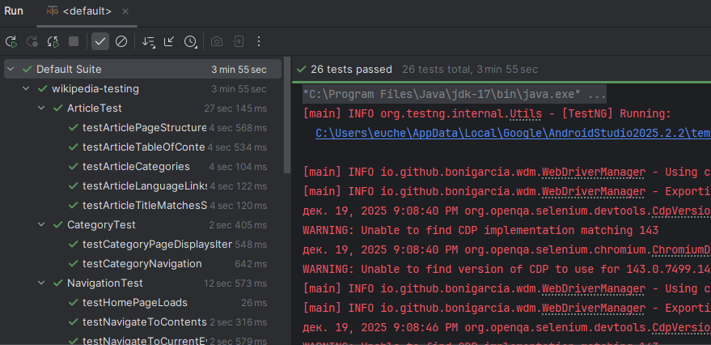
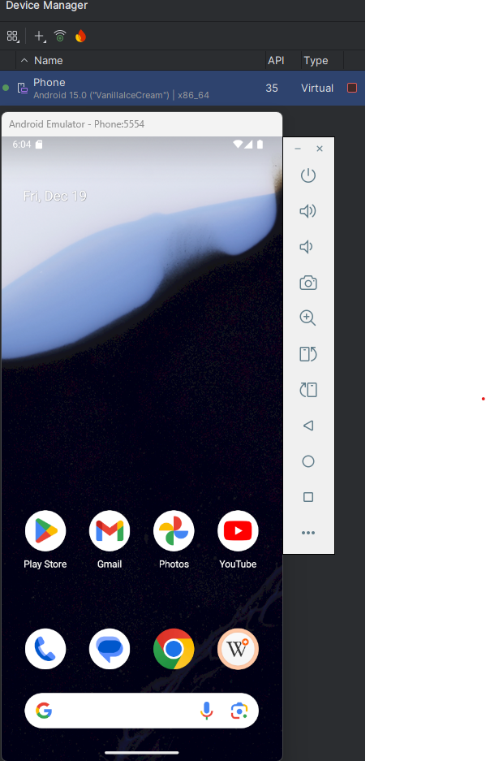
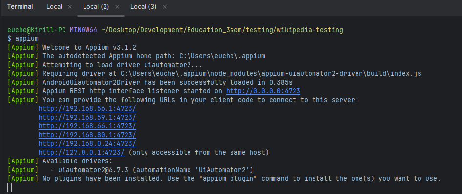

# Автоматизированные тесты для веб и мобильного приложения

## Описание проекта
Проект состоит из автоматизированных тестов:
1. Веб-сайта https://en.wikipedia.org (16 тестов)
2. Мобильного приложения альфа-версии Wikipedia (10 тестов)

## Технологии
- Java 23
- Selenium WebDriver
- Appium
- TestNG
- Gradle

## Требования
1. Наличие установленной версии Java 23
2. Наличие установленной последней версии Gradle
3. Наличие установленной актуальной версии браузера Google Chrome
4. Для мобильных тестов:
    - Установить NodeJS для автоматической установки менеджера пакетов **npm**
    - Выполнить установку Appium: `npm install -g appium`
    - Выполнить установку Android Studio с SDK-компонентами
    - Создать и настроить эмулятор Android 15.0 с именем **Phone**
    - Выполнить установку альфа-версии приложения **Wikipedia** на эмулятор

## Запуск тестов
```bash
./gradlew clean test
```



### 1. Веб-тесты (сайт en.wikipedia.org)
```bash
./gradlew clean test -Dtest.suite=src/test/resources/web-tests.xml
```

### 2. Мобильные тесты (альфа-версия Wikipedia)
Приложение скачано [wikipedia-alpha.apk](https://github.com/wikimedia/apps-android-wikipedia/releases/tag/latest)
- Запуск Android эмулятора
```bash
emulator -avd Phone
```


- Загрузка и установка приложения на эмулятор
```bash
adb -s emulator-5554 install wikipedia-alpha.apk
```

- Запуск Appium сервера
```bash
appium
```


- Запуск мобильных тестов
```bash
./gradlew test -Dtest.suite=src/test/resources/mobile-tests.xml
```